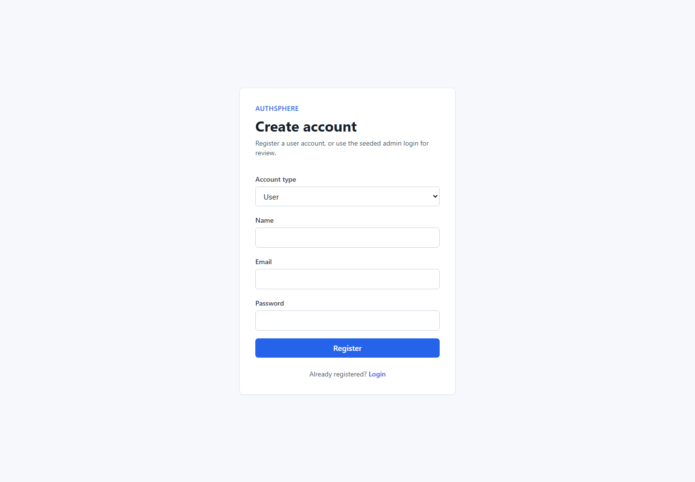
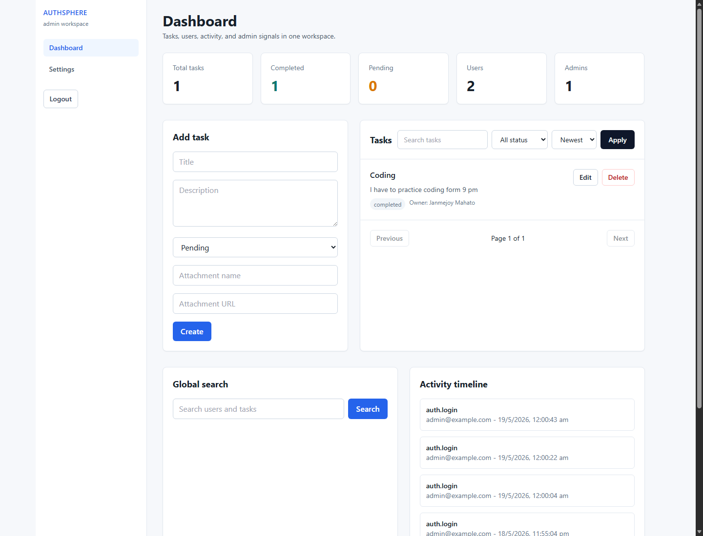

# 🔐 AuthSphere

AuthSphere is a production-ready **MERN stack authentication and task management system** built for a Backend Developer Intern assignment. It includes secure JWT auth, role-based access control, scalable REST APIs, Swagger/Postman documentation, Docker support, tests, and a clean React dashboard.

## 📸 Screenshots

> Screenshots are stored in `docs/screenshots/`.

| Auth | Dashboard |
| --- | --- |
|  |  |

If the images are missing, run the app locally and capture:

```text
http://localhost:5173/register
http://localhost:5173/dashboard
```

## ✨ Features

- 🔐 User registration and login
- 🔑 JWT access token + refresh token flow
- 🧂 Password hashing with `bcryptjs`
- 🛡️ Role-based access control: `user` and `admin`
- ✅ Task CRUD with ownership rules
- 🔎 Task search, filter, sort, pagination, and detail page
- 🧾 Audit logs and admin activity timeline
- 📊 Admin analytics dashboard
- 👥 Admin user management: list, update role, soft delete
- 👤 Profile update, change password, and soft delete account
- 🚦 Rate limiting for auth and API routes
- 🧼 Input validation and sanitization
- 📚 Swagger UI and Postman collection
- 🐳 Docker and production Dockerfiles
- 🧪 Backend tests with Jest, Supertest, and MongoDB Memory Server
- 🌗 Dark mode support
- 🚀 GitHub Actions CI

## 🧱 Tech Stack

| Layer | Tools |
| --- | --- |
| Frontend | React, Vite, React Router DOM, Axios, Tailwind CSS |
| Backend | Node.js, Express.js, MongoDB, Mongoose |
| Auth/Security | JWT, Refresh Tokens, bcryptjs, Helmet, CORS, Rate Limit |
| Docs | Swagger UI, Postman Collection |
| Testing | Jest, Supertest, MongoDB Memory Server |
| Deployment | Vercel, Render, MongoDB Atlas, Docker |

## 📁 Project Structure

```text
AuthSphere/
  backend/
    src/
      config/
      controllers/
      docs/
      middleware/
      models/
      routes/
      scripts/
      utils/
      validations/
    tests/
    .env.example
    Dockerfile
    Dockerfile.prod
    package.json
  frontend/
    src/
      api/
      components/
      context/
      pages/
    .env.example
    Dockerfile
    Dockerfile.prod
    package.json
  docs/
    screenshots/
  .github/workflows/ci.yml
  docker-compose.yml
```

## ⚙️ Backend Setup

```bash
cd backend
npm install
copy .env.example .env
npm run dev
```

Backend URL:

```text
http://localhost:5000
```

### 🔐 Backend Environment Variables

```env
PORT=5000
NODE_ENV=development
MONGO_URI=mongodb://127.0.0.1:27017/authsphere
JWT_SECRET=replace_with_a_long_secure_secret
JWT_EXPIRES_IN=15m
JWT_REFRESH_SECRET=replace_with_a_second_long_secure_secret
JWT_REFRESH_EXPIRES_IN=7d
CLIENT_URLS=http://localhost:5173,http://localhost:5174
ADMIN_NAME=Main Admin
ADMIN_EMAIL=admin@example.com
ADMIN_PASSWORD=Admin@12345
```

## 👑 Create Admin Account

Public registration always creates a normal `user`. Create or update the first admin safely with:

```bash
cd backend
npm run seed:admin
```

Then login with the admin email/password from `.env`.

## 🎨 Frontend Setup

```bash
cd frontend
npm install
copy .env.example .env
npm run dev
```

Frontend URL:

```text
http://localhost:5173
```

### 🌐 Frontend Environment Variables

```env
VITE_API_URL=http://localhost:5000/api/v1
VITE_DEMO_ADMIN_EMAIL=admin@example.com
VITE_DEMO_ADMIN_PASSWORD=Admin@12345
```

## 📚 API Documentation

Start the backend, then open Swagger:

```text
http://localhost:5000/api-docs
```

Postman collection:

```text
backend/src/docs/postman_collection.json
```

## 🔌 API Endpoints

Base URL:

```text
/api/v1
```

| Method | Endpoint | Access | Description |
| --- | --- | --- | --- |
| POST | `/auth/register` | Public | Register user |
| POST | `/auth/login` | Public | Login user |
| POST | `/auth/refresh` | Public cookie | Refresh access token |
| POST | `/auth/logout` | User/Admin | Logout and revoke refresh token |
| GET | `/auth/me` | User/Admin | Current logged-in user |
| GET | `/profile` | User/Admin | Get profile |
| PATCH | `/profile` | User/Admin | Update profile |
| PATCH | `/profile/password` | User/Admin | Change password |
| DELETE | `/profile` | User/Admin | Soft delete own profile |
| GET | `/tasks` | User/Admin | Paginated task list with filters |
| POST | `/tasks` | User/Admin | Create task |
| GET | `/tasks/:id` | User/Admin | Get task detail |
| PATCH | `/tasks/:id` | User/Admin | Update task |
| DELETE | `/tasks/:id` | User/Admin | Soft delete task |
| GET | `/users` | Admin | List users |
| PATCH | `/users/:id/role` | Admin | Update user role |
| DELETE | `/users/:id` | Admin | Soft delete user |
| GET | `/admin/analytics` | Admin | Dashboard analytics |
| GET | `/admin/activity` | Admin | Audit activity timeline |
| GET | `/admin/search?q=value` | Admin | Global search |

Task filters example:

```text
GET /api/v1/tasks?page=1&limit=10&status=pending&search=demo&sort=newest
```

## 🧪 Testing

```bash
cd backend
npm test
```

Current test coverage includes:

- ✅ Public registration creates only normal users
- ✅ Invalid login is rejected
- ✅ Task ownership and admin task visibility
- ✅ User route blocks non-admin access

## 🐳 Docker

Run the full local stack with MongoDB:

```bash
docker compose up --build
```

Services:

```text
Frontend: http://localhost:5173
Backend:  http://localhost:5000
MongoDB:  mongodb://localhost:27017/authsphere
```

Production Dockerfiles:

```text
backend/Dockerfile.prod
frontend/Dockerfile.prod
```

## 🚀 Deployment

### Backend on Render

1. Create a new Render Web Service.
2. Set root directory to `backend`.
3. Build command: `npm install`.
4. Start command: `npm start`.
5. Add all backend environment variables.
6. Use MongoDB Atlas for `MONGO_URI`.

### Frontend on Vercel

1. Import the repository in Vercel.
2. Set root directory to `frontend`.
3. Build command: `npm run build`.
4. Output directory: `dist`.
5. Set `VITE_API_URL` to your deployed backend API URL.

## 🧠 Security Notes

- Public users cannot self-register as admin.
- Admin is created through a protected seed script.
- Passwords are hashed using bcrypt.
- JWT access tokens are short-lived.
- Refresh token is stored in an HTTP-only cookie.
- Auth routes are rate limited.
- Inputs are validated and sanitized.
- Helmet adds secure HTTP headers.
- Soft delete protects against accidental permanent data loss.

## 📈 Scalability Notes

- API versioning uses `/api/v1`.
- Modular backend folders support new features cleanly.
- Task listing is paginated and indexed.
- Admin analytics use a short in-memory cache.
- Redis can later replace in-memory cache and improve rate limiting.
- Audit logs help production debugging and compliance.
- Multiple backend instances can run behind a load balancer.
- GitHub Actions CI runs backend tests and frontend builds.

## ✅ Assignment Checklist

- ✅ Registration and login APIs
- ✅ Password hashing
- ✅ JWT authentication
- ✅ Role-based access control
- ✅ Task CRUD APIs
- ✅ API versioning
- ✅ Error handling
- ✅ Validation and sanitization
- ✅ Swagger/Postman docs
- ✅ MongoDB schema with Mongoose
- ✅ React frontend UI
- ✅ Protected dashboard
- ✅ Docker support
- ✅ README setup and deployment guide

